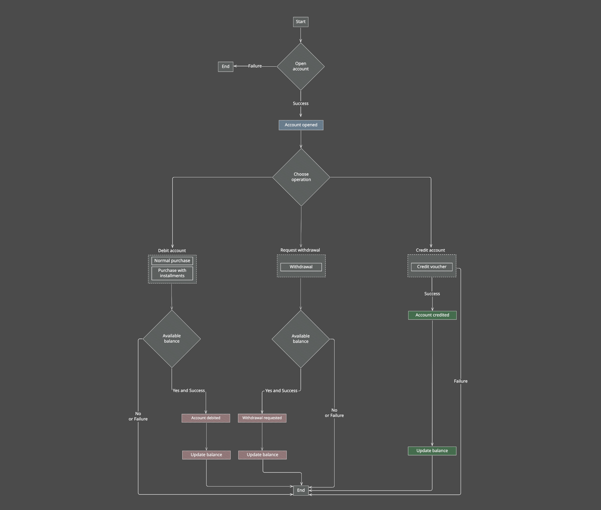

# Account

[](LICENSE)

* [Overview](#overview)
    - [Use cases](#use-cases)
    - [Queries](#queries)
    - [Health checks](#health-checks)
* [Installation](#installation)
    - [Repository](#repository)
    - [Configuration](#configuration)
    - [Tests](#tests)
    - [Review](#review)
    - [Reports](#reports)
* [Environment setup](#environment-setup)
    - [Access URLs](#access-urls)
    - [Environment variables](#environment-variables)
* [Observability](#observability)

## Overview

Each cardholder (holder) has an account with their information. For each operation performed, a transaction is created
and associated with the respective account. Transactions have specific types, e.g., **Normal Purchase**, **Purchase with
installments**, **Withdrawal**, and **Credit Voucher**. **Normal Purchase** and **Withdrawal** transactions are recorded
with **negative** values, while **Credit Voucher**
transactions are recorded with **positive** values.

The HTTP contract is published in `openapi.yaml` at the repository root and detailed in the documentation pages linked
below. To exercise it, import the [Postman collection](docs/postman/account.postman_collection.json). It covers every
operation, and running it top to bottom against a local stack opens an account, moves money across the four operation
types, and reads the result back. It carries its own `baseUrl`, so no environment import is needed to point it at
`http://account.localhost:8090`.

<!--suppress HtmlDeprecatedAttribute -->
<p align="center">
    
</p>

<p align="center"><small>Figure 01: Account transaction flow diagram.</small></p>

### Use cases

- [Account opening](docs/USE_CASES.md#account-opening)
- [Transaction creating](docs/USE_CASES.md#transaction-creating)

### Queries

- [Find account by id](docs/QUERIES.md#find-account-by-id)
- [Find account balance](docs/QUERIES.md#find-account-balance)
- [Find account transactions](docs/QUERIES.md#find-account-transactions)

### Health checks

- [Liveness check](docs/HEALTH.md#liveness-check)
- [Readiness check](docs/HEALTH.md#readiness-check)

## Installation

### Repository

To clone the repository using the command line, run:

```bash
git clone https://github.com/gustavofreze/account.git
```

### Configuration

To install project dependencies locally, run:

```bash
make configure
```

To start the application containers, run:

```bash
make start
```

To stop the application containers, run:

```bash
make stop
```

### Tests

Run all tests with coverage and mutation testing:

```bash
make tests
```

Run a single test file:

```bash
make test-file FILE=AccountTest
```

### Review

Run static code analysis:

```bash
make review
```

Fix static code analysis issues:

```bash
make fix-review
```

### Reports

Open static analysis reports (e.g., coverage, lints) in the browser:

```bash
make show-reports
```

### Maintenance

Remove dependencies and generated artifacts:

```bash
make clean
```

> You can check other available commands by running `make help`.

## Environment setup

### Access URLs

| Environment | DNS                           |
|:------------|:------------------------------|
| `Local`     | http://account.localhost:8090 |

### Environment variables

Every variable the application and its migration run read. This is a proof of concept, so `.env.local` is committed at
the repository root and the `Development value` column below is the literal content of that file. Every value in it is a
local-only default and never a real credential. A deployed environment supplies its own values through the container
environment instead. The `Makefile` hands the file to Docker Compose with `--env-file`, and both the `account` and the
`account-migrate` services load it through `env_file`.

| Variable                           | Description                                                             | Development value                                                                                               |
|:-----------------------------------|:------------------------------------------------------------------------|:----------------------------------------------------------------------------------------------------------------|
| `DEBUG`                            | Toggles the detailed error output of the HTTP error handler             | `false`                                                                                                         |
| `SOURCE`                           | Repository URL the application reports as its source                    | `https://github.com/gustavofreze/account`                                                                       |
| `APP_NAME`                         | Component name the structured logger stamps on every entry              | `account`                                                                                                       |
| `DATABASE_HOST`                    | Database host (docker service name)                                     | `account-adm`                                                                                                   |
| `DATABASE_PORT`                    | Database port inside the compose network, published on the host as 3307 | `3306`                                                                                                          |
| `DATABASE_NAME`                    | Database schema name                                                    | `account_adm`                                                                                                   |
| `DATABASE_USER`                    | Database user the application connects as                               | `root`                                                                                                          |
| `DATABASE_PASSWORD`                | Password of the database user                                           | `root`                                                                                                          |
| `FLYWAY_URL`                       | JDBC URL the migration run connects to                                  | `jdbc:mysql://account-adm:3306/account_adm?allowPublicKeyRetrieval=true&useUnicode=yes&characterEncoding=UTF-8` |
| `FLYWAY_USER`                      | Database user the migration run connects as                             | `root`                                                                                                          |
| `FLYWAY_TABLE`                     | Table Flyway keeps its schema history in                                | `schema_history`                                                                                                |
| `FLYWAY_SCHEMAS`                   | Schema the migrations are applied to                                    | `account_adm`                                                                                                   |
| `FLYWAY_PASSWORD`                  | Password of the migration user                                          | `root`                                                                                                          |
| `FLYWAY_LOCATIONS`                 | Directory the migration files are read from                             | `filesystem:/flyway/sql`                                                                                        |
| `FLYWAY_CLEAN_DISABLED`            | Blocks `flyway clean` from dropping the schema                          | `false`                                                                                                         |
| `FLYWAY_VALIDATE_MIGRATION_NAMING` | Fails the migration run when a file name breaks the Flyway convention   | `true`                                                                                                          |

## Observability

The structured logger writes to standard output, so the container runtime holds the log stream. Follow it with:

```bash
docker logs -f account
```
